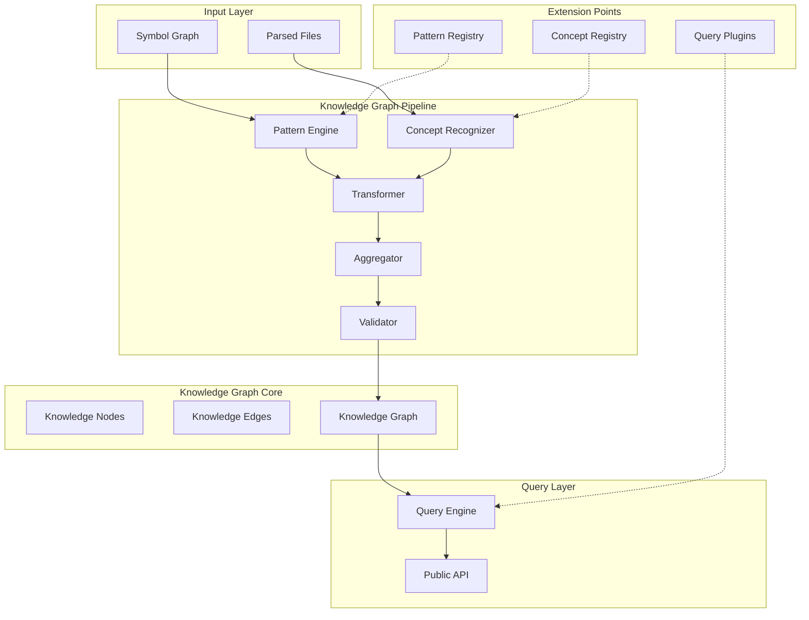

# Knowledge Graph - Architecture & Design Document

**Story ID:** DF-007.1  
**Status:** Design Review  
**Author:** Principal Software Architect  
**Date:** 2026-07-13

---

## Table of Contents

1. [Executive Summary](#1-executive-summary)
2. [Architecture Diagram](#2-architecture-diagram)
3. [Node Model](#3-node-model)
4. [Edge Model](#4-edge-model)
5. [Transformation Pipeline](#5-transformation-pipeline)
6. [Public API](#6-public-api)
7. [Internal Architecture](#7-internal-architecture)
8. [Query Model](#8-query-model)
9. [Performance Considerations](#9-performance-considerations)
10. [Memory Considerations](#10-memory-considerations)
11. [Extension Points](#11-extension-points)
12. [Trade-offs](#12-trade-offs)
13. [Risks](#13-risks)
14. [Recommendation](#14-recommendation)
15. [Phased Implementation Plan](#15-phased-implementation-plan)

---

## 1. Executive Summary

### 1.1 Problem Statement

The Symbol Graph represents syntactic structures (classes, functions, interfaces, types) and their reference relationships. The Knowledge Graph must represent **architectural concepts** (modules, features, domains, services, APIs, repositories, databases) and their **architectural relationships** (ownership, dependency, communication, persistence).

### 1.2 Design Goals

| Goal | Description |
|------|-------------|
| **Architectural Abstraction** | Transform syntax → architecture |
| **Language Agnostic** | Works with TypeScript, Java, Go, Rust, Python |
| **Deterministic** | No AI, no heuristics, pure rules |
| **Queryable** | Answer architectural questions efficiently |
| **Extensible** | Plugin architecture for custom node/edge types |
| **Performant** | Sub-100ms queries on 100K+ node graphs |

### 1.3 Non-Goals

- ❌ Natural language queries
- ❌ Vector embeddings / semantic search
- ❌ AI-powered architecture inference
- ❌ Runtime behavior analysis

---

## 2. Architecture Diagram



---

## 3. Node Model

### 3.1 Knowledge Node Types

```typescript
type KnowledgeNodeKind =
  // Structural
  | "module"              // A logical module (package, namespace, crate)
  | "feature"             // A user-facing feature
  | "domain"              // A bounded context / domain
  | "layer"               // Architectural layer (presentation, domain, infra)
  
  // Runtime
  | "service"             // A service (microservice, class, module)
  | "api"                 // Public API surface (REST, GraphQL, gRPC, CLI)
  | "repository"          // Data access abstraction
  | "database"            // Physical database / data store
  | "queue"               // Message queue / event bus
  | "cache"               // Cache layer
  
  // External
  | "external-dependency" // npm package, Maven artifact, Go module
  | "external-service"    // Third-party API (Stripe, AWS, Auth0)
  
  // Configuration
  | "configuration"       // Config files, env vars, feature flags
  | "infrastructure"      // K8s, Terraform, Docker, CI/CD
  
  // Cross-cutting
  | "boundary"            // Architectural boundary (ports/adapters)
  | "contract"            // Shared contracts / DTOs / schemas
  | "utility";            // Shared utilities / helpers
```

### 3.2 Knowledge Node Definition

```typescript
interface KnowledgeNode {
  // Identity
  readonly id: KnowledgeNodeId;           // "kg:module:auth" | "kg:service:user-service"
  readonly kind: KnowledgeNodeKind;
  readonly name: string;                   // Human-readable name
  readonly qualifiedName: string;          // Fully qualified (e.g., "auth.authentication")
  
  // Source traceability
  readonly sourceSymbols: ReadonlyArray<SymbolId>;  // Symbol Graph nodes that created this
  readonly sourceFiles: ReadonlyArray<string>;      // File paths contributing to this node
  
  // Properties (extensible, language-agnostic)
  readonly properties: KnowledgeNodeProperties;
  
  // Metadata
  readonly confidence: ConfidenceScore;    // 0.0 - 1.0 (deterministic rules = 1.0)
  readonly createdAt: Timestamp;
  readonly version: number;
}

interface KnowledgeNodeProperties {
  // Common properties (all nodes)
  readonly description?: string;
  readonly tags?: ReadonlyArray<string>;
  readonly ownership?: OwnershipInfo;
  
  // Kind-specific properties (discriminated by kind)
  readonly module?: ModuleProperties;
  readonly feature?: FeatureProperties;
  readonly service?: ServiceProperties;
  readonly api?: ApiProperties;
  readonly repository?: RepositoryProperties;
  readonly database?: DatabaseProperties;
  readonly externalDependency?: ExternalDependencyProperties;
  // ... extensible via registry
}

// Kind-specific property types
interface ModuleProperties {
  readonly language: Language;
  readonly isPublic: boolean;
  readonly exports: ReadonlyArray<string>;
  readonly layer?: "presentation" | "domain" | "infrastructure" | "shared";
}

interface ServiceProperties {
  readonly protocol?: "http" | "grpc" | "message" | "cli";
  readonly port?: number;
  readonly healthEndpoint?: string;
  readonly replicas?: number;
}

interface ApiProperties {
  readonly type: "rest" | "graphql" | "grpc" | "websocket" | "cli";
  readonly basePath?: string;
  readonly version?: string;
  readonly openApiSpec?: string;
}

interface RepositoryProperties {
  readonly entityType: string;
  readonly methods: ReadonlyArray<string>; // findById, save, delete, etc.
}

interface DatabaseProperties {
  readonly type: "relational" | "document" | "key-value" | "graph" | "time-series";
  readonly engine?: string; // postgres, mongodb, redis
  readonly schema?: string;
}

interface ExternalDependencyProperties {
  readonly packageManager: "npm" | "maven" | "go" | "cargo" | "pip" | "nuget";
  readonly packageName: string;
  readonly version: string;
  readonly isDevDependency: boolean;
}
```

### 3.3 Node Identity Strategy

```
KnowledgeNodeId = `kg:${kind}:${normalizedQualifiedName}`

Examples:
  kg:module:auth.authentication
  kg:service:user-service
  kg:api:user-api
  kg:repository:user-repository
  kg:database:users-db
  kg:external-dependency:npm:express@4.18.0
  kg:feature:user-management
  kg:domain:identity
  kg:layer:presentation
  kg:boundary:auth-port
```

---

## 4. Edge Model

### 4.1 Knowledge Edge Types

```typescript
type KnowledgeEdgeKind =
  // Structural ownership
  | "contains"              // Module contains Feature/Service
  | "owns"                  // Domain owns Service/Repository
  | "belongsTo"             // Service belongs to Domain
  
  // Dependency
  | "dependsOn"             // Service depends on Service/Repository/External
  | "imports"               // Module imports Module
  | "requires"              // Feature requires Service/API
  
  // Exposure
  | "exposes"               // Service exposes API
  | "implements"            // Service implements API/Contract
  | "provides"              // Module provides Feature
  
  // Data flow
  | "readsFrom"             // Service reads from Repository/Database
  | "writesTo"              // Service writes to Repository/Database/Queue
  | "publishesTo"           // Service publishes to Queue/EventBus
  | "subscribesTo"          // Service subscribes to Queue/EventBus
  | "cachesIn"              // Service caches in Cache
  
  // Communication
  | "calls"                 // Service calls Service (sync)
  | "sendsTo"               // Service sends to Service (async)
  | "communicatesWith"      // Bidirectional
  
  // Architecture
  | "crossesBoundary"       // Crosses architectural boundary
  | "conformsTo"            // Implementation conforms to Contract
  | "delegatesTo"           // Delegates responsibility
  
  // Configuration
  | "configuredBy"          // Service configured by Configuration
  | "deployedOn"            // Service deployed on Infrastructure
  
  // External
  | "usesExternal"          // Uses external dependency/service
  | "integratesWith";       // Integrates with external service
```

### 4.2 Knowledge Edge Definition

```typescript
interface KnowledgeEdge {
  readonly id: KnowledgeEdgeId;
  readonly kind: KnowledgeEdgeKind;
  readonly from: KnowledgeNodeId;
  readonly to: KnowledgeNodeId;
  
  // Evidence from Symbol Graph
  readonly evidence: ReadonlyArray<EdgeEvidence>;
  
  // Properties
  readonly properties: KnowledgeEdgeProperties;
  
  // Metadata
  readonly confidence: ConfidenceScore;
  readonly createdAt: Timestamp;
}

interface EdgeEvidence {
  readonly type: "symbol-reference" | "import" | "decorator" | "config" | "naming" | "structure";
  readonly symbolId?: SymbolId;           // Symbol Graph reference
  readonly filePath?: string;
  readonly line?: number;
  readonly description: string;
}

interface KnowledgeEdgeProperties {
  readonly weight?: number;                // 0.0 - 1.0 (strength of relationship)
  readonly isOptional?: boolean;
  readonly direction?: "unidirectional" | "bidirectional";
  readonly protocol?: string;              // http, grpc, amqp, etc.
  readonly frequency?: "high" | "medium" | "low" | "on-demand";
  readonly criticality?: "critical" | "important" | "nice-to-have";
}
```

---

## 5. Transformation Pipeline

### 5.1 Overview

```
Symbol Graph ──▶ Pattern Engine ──▶ Concept Recognizer ──▶ Transformer ──▶ Aggregator ──▶ Validator ──▶ Knowledge Graph
     │                    │                    │               │             │            │
     ▼                    ▼                    ▼               ▼             ▼            ▼
  Nodes/Edges        Pattern Matches    Concept Matches   KG Nodes      Merged       Validated
```

### 5.2 Stage 1: Pattern Engine

**Purpose:** Detect structural patterns in Symbol Graph that indicate architectural concepts.

```typescript
interface PatternMatch {
  readonly patternId: string;
  readonly matchedNodes: ReadonlyArray<SymbolNode>;
  readonly matchedEdges: ReadonlyArray<SymbolEdge>;
  readonly confidence: ConfidenceScore;
  readonly suggestedConcept: KnowledgeNodeKind;
  readonly suggestedProperties: Partial<KnowledgeNodeProperties>;
}

interface PatternRule {
  readonly id: string;
  readonly name: string;
  readonly description: string;
  readonly applicableKinds: ReadonlyArray<SymbolNodeKind>;
  readonly match: (node: SymbolNode, context: PatternContext) => PatternMatch | null;
  readonly priority: number;  // Higher = more specific
}

interface PatternContext {
  readonly symbolGraph: SymbolGraph;
  readonly parsedFiles: ReadonlyArray<ParsedFile>;
  readonly fileSymbols: Map<string, ReadonlyArray<SymbolNode>>;
  readonly language: Language;
}
```

**Built-in Patterns (Language-Agnostic):**

| Pattern ID | Detects | Input Symbols | Output Concept |
|------------|---------|---------------|----------------|
| `module.directory` | Module from directory structure | Directory with index/barrel file | `module` |
| `module.package-json` | Module from package.json | package.json with main/exports | `module` |
| `service.class-suffix` | Service class | Class ending in `Service` | `service` |
| `service.interface-suffix` | Service interface | Interface ending in `Service` | `service` |
| `repository.class-suffix` | Repository class | Class ending in `Repository`/`Dao` | `repository` |
| `controller.class-suffix` | Controller (API) | Class ending in `Controller`/`Handler` | `api` |
| `entity.class-suffix` | Entity | Class ending in `Entity`/`Model` | `database` |
| `config.file` | Configuration | *.config.*, *.env*, config/ dir | `configuration` |
| `external.import` | External dependency | Import from node_modules/vendor | `external-dependency` |
| `feature.directory` | Feature module | Directory under features/ or modules/ | `feature` |
| `domain.directory` | Domain | Directory under domains/ or bounded-contexts/ | `domain` |
| `layer.naming` | Architectural layer | Directory naming (presentation/, domain/, infra/) | `layer` |

### 5.3 Stage 2: Concept Recognizer

**Purpose:** Apply language-specific recognition rules to refine pattern matches.

```typescript
interface ConceptRecognizer {
  readonly language: Language;
  readonly recognize: (matches: ReadonlyArray<PatternMatch>, context: RecognizerContext) => ReadonlyArray<ConceptCandidate>;
}

interface RecognizerContext {
  readonly symbolGraph: SymbolGraph;
  readonly parsedFiles: ReadonlyArray<ParsedFile>;
  readonly projectRoot: string;
  readonly config: KnowledgeGraphConfig;
}

interface ConceptCandidate {
  readonly kind: KnowledgeNodeKind;
  readonly name: string;
  readonly qualifiedName: string;
  readonly sourceSymbols: ReadonlyArray<SymbolId>;
  readonly sourceFiles: ReadonlyArray<string>;
  readonly properties: Partial<KnowledgeNodeProperties>;
  readonly confidence: ConfidenceScore;
  readonly recognizerId: string;
}
```

**Language-Specific Recognizers:**

| Language | Recognizer ID | Detects |
|----------|---------------|---------|
| TypeScript | `ts.decorator.service` | `@Injectable()` classes → service |
| TypeScript | `ts.decorator.controller` | `@Controller()` → api |
| TypeScript | `ts.decorator.entity` | `@Entity()` → database |
| TypeScript | `ts.decorator.repository` | `@Repository()` → repository |
| Java | `java.annotation.service` | `@Service` → service |
| Java | `java.annotation.repository` | `@Repository` → repository |
| Java | `java.annotation.restcontroller` | `@RestController` → api |
| Java | `java.annotation.entity` | `@Entity` → database |
| Go | `go.struct.suffix` | Struct suffix conventions |
| Python | `py.decorator.fastapi` | FastAPI decorators → api |
| Rust | `rs.actix.handler` | Actix handlers → api |

### 5.4 Stage 3: Transformer

**Purpose:** Convert Concept Candidates → Knowledge Nodes.

```typescript
interface Transformer {
  transform(candidates: ReadonlyArray<ConceptCandidate>): ReadonlyArray<KnowledgeNode>;
}

function transformCandidates(
  candidates: ReadonlyArray<ConceptCandidate>,
  symbolGraph: SymbolGraph
): ReadonlyArray<KnowledgeNode> {
  // 1. Group by identity (qualifiedName + kind)
  const grouped = groupByIdentity(candidates);
  
  // 2. Merge candidates for same identity
  const merged = Array.from(grouped.values()).map(mergeCandidates);
  
  // 3. Assign stable IDs
  const withIds = merged.map(assignKnowledgeNodeId);
  
  // 4. Enrich with computed properties
  return withIds.map(enrichWithComputedProperties);
}
```

### 5.5 Stage 4: Aggregator (Edge Construction)

**Purpose:** Build Knowledge Edges from Symbol Graph relationships.

```typescript
interface EdgeAggregator {
  aggregate(nodes: ReadonlyArray<KnowledgeNode>, symbolGraph: SymbolGraph): ReadonlyArray<KnowledgeEdge>;
}

function aggregateEdges(
  nodes: ReadonlyArray<KnowledgeNode>,
  symbolGraph: SymbolGraph
): ReadonlyArray<KnowledgeEdge> {
  const edges: KnowledgeEdge[] = [];
  
  // 1. Structural edges (contains, owns, belongsTo)
  edges.push(...buildStructuralEdges(nodes, symbolGraph));
  
  // 2. Dependency edges (dependsOn, imports, requires)
  edges.push(...buildDependencyEdges(nodes, symbolGraph));
  
  // 3. Exposure edges (exposes, implements, provides)
  edges.push(...buildExposureEdges(nodes, symbolGraph));
  
  // 4. Data flow edges (readsFrom, writesTo, publishesTo)
  edges.push(...buildDataFlowEdges(nodes, symbolGraph));
  
  // 5. Communication edges (calls, sendsTo)
  edges.push(...buildCommunicationEdges(nodes, symbolGraph));
  
  // 6. Architecture edges (crossesBoundary, conformsTo)
  edges.push(...buildArchitectureEdges(nodes, symbolGraph));
  
  // 7. Deduplicate and merge evidence
  return deduplicateEdges(edges);
}
```

### 5.6 Stage 5: Validator

**Purpose:** Ensure graph consistency and completeness.

```typescript
interface ValidationRule {
  readonly id: string;
  readonly severity: "error" | "warning" | "info";
  readonly validate: (graph: KnowledgeGraph) => ReadonlyArray<ValidationIssue>;
}

const builtInValidators: ReadonlyArray<ValidationRule> = [
  { id: "orphan-node", severity: "warning", validate: checkOrphanNodes },
  { id: "circular-dependency", severity: "error", validate: checkCircularDependencies },
  { id: "missing-owner", severity: "warning", validate: checkMissingOwners },
  { id: "unresolved-external", severity: "info", validate: checkUnresolvedExternals },
  { id: "layer-violation", severity: "error", validate: checkLayerViolations },
];
```

---

## 6. Public API

### 6.1 Core Types

```typescript
// packages/knowledge-graph/src/types.ts

export type KnowledgeNodeKind = /* as defined in Section 3.1 */;
export type KnowledgeEdgeKind = /* as defined in Section 4.1 */;

export interface KnowledgeNode {
  readonly id: KnowledgeNodeId;
  readonly kind: KnowledgeNodeKind;
  readonly name: string;
  readonly qualifiedName: string;
  readonly sourceSymbols: ReadonlyArray<SymbolId>;
  readonly sourceFiles: ReadonlyArray<string>;
  readonly properties: KnowledgeNodeProperties;
  readonly confidence: ConfidenceScore;
  readonly createdAt: Timestamp;
  readonly version: number;
}

export interface KnowledgeEdge {
  readonly id: KnowledgeEdgeId;
  readonly kind: KnowledgeEdgeKind;
  readonly from: KnowledgeNodeId;
  readonly to: KnowledgeNodeId;
  readonly evidence: ReadonlyArray<EdgeEvidence>;
  readonly properties: KnowledgeEdgeProperties;
  readonly confidence: ConfidenceScore;
  readonly createdAt: Timestamp;
}

export interface KnowledgeGraph {
  readonly nodes: ReadonlyMap<KnowledgeNodeId, KnowledgeNode>;
  readonly edges: ReadonlyArray<KnowledgeEdge>;
  readonly metadata: KnowledgeGraphMetadata;
}

export interface KnowledgeGraphMetadata {
  readonly version: string;
  readonly createdAt: Timestamp;
  readonly symbolGraphVersion: string;
  readonly nodeCount: number;
  readonly edgeCount: number;
  readonly languages: ReadonlyArray<Language>;
  readonly configHash: string;
}
```

### 6.2 Builder API

```typescript
// packages/knowledge-graph/src/builder.ts

export interface KnowledgeGraphConfig {
  readonly projectRoot: string;
  readonly patterns?: ReadonlyArray<PatternRule>;
  readonly recognizers?: ReadonlyArray<ConceptRecognizer>;
  readonly validators?: ReadonlyArray<ValidationRule>;
  readonly layerNaming?: LayerNamingConfig;
  readonly featurePaths?: ReadonlyArray<string>;
  readonly domainPaths?: ReadonlyArray<string>;
  readonly excludePatterns?: ReadonlyArray<string>;
  readonly confidenceThreshold?: ConfidenceScore; // default: 0.7
}

export interface LayerNamingConfig {
  readonly presentation: ReadonlyArray<string>; // ["presentation", "ui", "web", "client"]
  readonly domain: ReadonlyArray<string>;       // ["domain", "core", "business"]
  readonly infrastructure: ReadonlyArray<string>; // ["infrastructure", "infra", "data", "persistence"]
  readonly shared: ReadonlyArray<string>;       // ["shared", "common", "utils", "lib"]
}

export function buildKnowledgeGraph(
  symbolGraph: SymbolGraph,
  parsedFiles: ReadonlyArray<ParsedFile>,
  config: KnowledgeGraphConfig
): KnowledgeGraph;

export function buildKnowledgeGraphSync(
  symbolGraph: SymbolGraph,
  parsedFiles: ReadonlyArray<ParsedFile>,
  config: KnowledgeGraphConfig
): KnowledgeGraph;
```

### 6.3 Query API

```typescript
// packages/knowledge-graph/src/query.ts

export interface KnowledgeGraphQuery {
  readonly graph: KnowledgeGraph;
  
  // Node queries
  getNode(id: KnowledgeNodeId): KnowledgeNode | undefined;
  getNodesByKind(kind: KnowledgeNodeKind): ReadonlyArray<KnowledgeNode>;
  getNodesByProperty<T>(kind: KnowledgeNodeKind, key: string, value: T): ReadonlyArray<KnowledgeNode>;
  findNodes(query: NodeQuery): ReadonlyArray<KnowledgeNode>;
  
  // Edge queries
  getEdgesFrom(from: KnowledgeNodeId): ReadonlyArray<KnowledgeEdge>;
  getEdgesTo(to: KnowledgeNodeId): ReadonlyArray<KnowledgeEdge>;
  getEdgesBetween(from: KnowledgeNodeId, to: KnowledgeNodeId): ReadonlyArray<KnowledgeEdge>;
  getEdgesByKind(kind: KnowledgeEdgeKind): ReadonlyArray<KnowledgeEdge>;
  findEdges(query: EdgeQuery): ReadonlyArray<KnowledgeEdge>;
  
  // Traversal
  traverse(start: KnowledgeNodeId, options: TraversalOptions): TraversalResult;
  findPath(from: KnowledgeNodeId, to: KnowledgeNodeId, options?: PathOptions): KnowledgePath | null;
  findAllPaths(from: KnowledgeNodeId, to: KnowledgeNodeId, options?: PathOptions): ReadonlyArray<KnowledgePath>;
  
  // Architectural queries
  getModuleOwnership(moduleId: KnowledgeNodeId): OwnershipReport;
  getServiceDependencies(serviceId: KnowledgeNodeId): DependencyReport;
  getFeatureMap(featureId: KnowledgeNodeId): FeatureMap;
  getDomainBoundaries(): ReadonlyArray<DomainBoundary>;
  getLayerViolations(): ReadonlyArray<LayerViolation>;
  getApiSurface(apiId: KnowledgeNodeId): ApiSurface;
  getDatabaseAccessors(databaseId: KnowledgeNodeId): ReadonlyArray<KnowledgeNode>;
}

export interface TraversalOptions {
  readonly direction: "outgoing" | "incoming" | "both";
  readonly edgeKinds?: ReadonlyArray<KnowledgeEdgeKind>;
  readonly nodeKinds?: ReadonlyArray<KnowledgeNodeKind>;
  readonly maxDepth?: number;
  readonly maxNodes?: number;
  readonly filter?: (node: KnowledgeNode, edge: KnowledgeEdge) => boolean;
}

export interface PathOptions {
  readonly maxPaths?: number;
  readonly maxDepth?: number;
  readonly edgeKinds?: ReadonlyArray<KnowledgeEdgeKind>;
}
```

### 6.4 Serialization

```typescript
// packages/knowledge-graph/src/serialization.ts

export function serializeKnowledgeGraph(graph: KnowledgeGraph): string;
export function deserializeKnowledgeGraph(json: string): KnowledgeGraph;

export function exportToGraphML(graph: KnowledgeGraph): string;
export function exportToDOT(graph: KnowledgeGraph): string;
export function exportToMermaid(graph: KnowledgeGraph): string;
```

---

## 7. Internal Architecture

### 7.1 Package Structure

```
packages/knowledge-graph/
├── src/
│   ├── types.ts              # Core type definitions
│   ├── config.ts             # Configuration types & defaults
│   ├── builder.ts            # Main buildKnowledgeGraph() entry point
│   ├── pipeline/
│   │   ├── index.ts          # Pipeline orchestration
│   │   ├── pattern-engine.ts # Stage 1: Pattern matching
│   │   ├── concept-recognizer.ts # Stage 2: Language-specific recognition
│   │   ├── transformer.ts    # Stage 3: Candidate → Node
│   │   ├── aggregator.ts     # Stage 4: Edge construction
│   │   └── validator.ts      # Stage 5: Validation
│   ├── patterns/
│   │   ├── index.ts          # Pattern registry
│   │   ├── builtin.ts        # Built-in pattern rules
│   │   └── registry.ts       # Pattern registration API
│   ├── recognizers/
│   │   ├── index.ts          # Recognizer registry
│   │   ├── typescript.ts     # TypeScript-specific recognizers
│   │   ├── java.ts           # Java-specific recognizers
│   │   ├── go.ts             # Go-specific recognizers
│   │   ├── python.ts         # Python-specific recognizers
│   │   └── rust.ts           # Rust-specific recognizers
│   ├── query/
│   │   ├── index.ts          # Query engine
│   │   ├── traversal.ts      # Graph traversal algorithms
│   │   ├── pathfinding.ts    # Path finding (BFS, Dijkstra)
│   │   └── architectural.ts  # Architectural query helpers
│   ├── serialization/
│   │   ├── index.ts
│   │   ├── json.ts
│   │   ├── graphml.ts
│   │   ├── dot.ts
│   │   └── mermaid.ts
│   └── index.ts              # Public exports
├── test/
│   ├── fixtures/
│   ├── builder.test.ts
│   ├── pipeline.test.ts
│   ├── patterns.test.ts
│   ├── recognizers.test.ts
│   └── query.test.ts
├── package.json
└── tsconfig.json
```

### 7.2 Pipeline Orchestration

```typescript
// packages/knowledge-graph/src/pipeline/index.ts

export interface PipelineContext {
  readonly symbolGraph: SymbolGraph;
  readonly parsedFiles: ReadonlyArray<ParsedFile>;
  readonly config: KnowledgeGraphConfig;
  readonly projectRoot: string;
  readonly language: Language; // Primary language, or "multi"
}

export interface PipelineResult {
  readonly nodes: ReadonlyArray<KnowledgeNode>;
  readonly edges: ReadonlyArray<KnowledgeEdge>;
  readonly issues: ReadonlyArray<ValidationIssue>;
  readonly stats: PipelineStats;
}

export function runPipeline(context: PipelineContext): PipelineResult {
  const { symbolGraph, parsedFiles, config } = context;
  
  // Stage 1: Pattern Engine
  const patternMatches = runPatternEngine(symbolGraph, parsedFiles, config);
  
  // Stage 2: Concept Recognizer
  const conceptCandidates = runConceptRecognizers(patternMatches, context);
  
  // Stage 3: Transformer
  const nodes = transformCandidates(conceptCandidates, symbolGraph);
  
  // Stage 4: Aggregator
  const edges = aggregateEdges(nodes, symbolGraph);
  
  // Stage 5: Validator
  const graph = createKnowledgeGraph(nodes, edges, context);
  const issues = validateGraph(graph, config);
  
  return { nodes, edges, issues, stats: computeStats(graph) };
}
```

### 7.3 Pattern Registry

```typescript
// packages/knowledge-graph/src/patterns/registry.ts

export interface PatternRegistry {
  register(pattern: PatternRule): void;
  unregister(patternId: string): void;
  get(patternId: string): PatternRule | undefined;
  getAll(): ReadonlyArray<PatternRule>;
  getByKind(kind: SymbolNodeKind): ReadonlyArray<PatternRule>;
}

export const patternRegistry = createPatternRegistry();

// Built-in patterns are auto-registered
import "./builtin.js";
```

### 7.4 Recognizer Registry

```typescript
// packages/knowledge-graph/src/recognizers/index.ts

export interface RecognizerRegistry {
  register(recognizer: ConceptRecognizer): void;
  unregister(recognizerId: string): void;
  get(recognizerId: string): ConceptRecognizer | undefined;
  getByLanguage(language: Language): ReadonlyArray<ConceptRecognizer>;
  getAll(): ReadonlyArray<ConceptRecognizer>;
}

export const recognizerRegistry = createRecognizerRegistry();

// Language recognizers auto-register
import "./typescript.js";
import "./java.js";
import "./go.js";
import "./python.js";
import "./rust.js";
```

---

## 8. Query Model

### 8.1 Core Queries

| Query | Description | Complexity |
|-------|-------------|------------|
| `getModuleOwnership(moduleId)` | All services/features owned by module | O(edges) |
| `getServiceDependencies(serviceId)` | Transitive closure of dependencies | O(V+E) |
| `getFeatureMap(featureId)` | All nodes/edges in feature | O(V+E) |
| `getDomainBoundaries()` | All domain boundaries & crossings | O(V+E) |
| `getLayerViolations()` | Violations of layer architecture | O(V+E) |
| `getApiSurface(apiId)` | All endpoints, models, consumers | O(edges) |
| `getDatabaseAccessors(dbId)` | Services reading/writing to database | O(edges) |

### 8.2 Traversal & Pathfinding

```typescript
// BFS for shortest path
findPath(from, to, { maxDepth: 10, edgeKinds: ["dependsOn", "calls"] })

// All paths (bounded)
findAllPaths(from, to, { maxPaths: 100, maxDepth: 15 })

// Architectural reachability
traverse(serviceId, { 
  direction: "outgoing",
  edgeKinds: ["dependsOn", "calls", "readsFrom", "writesTo"],
  maxDepth: 5 
})
```

### 8.3 Architectural Views

```typescript
interface ArchitecturalViews {
  // Module dependency graph
  moduleDependencies(): ModuleDependencyGraph;
  
  // Service communication graph
  serviceCommunication(): ServiceCommunicationGraph;
  
  // Data flow diagram
  dataFlow(): DataFlowDiagram;
  
  // Domain context map
  domainContextMap(): DomainContextMap;
  
  // Layer architecture
  layerArchitecture(): LayerArchitecture;
  
  // API topology
  apiTopology(): ApiTopology;
}
```

---

## 9. Performance Considerations

### 9.1 Complexity Analysis

| Operation | Time | Space |
|-----------|------|-------|
| Build Knowledge Graph | O(S + P×R) | O(N + E) |
| Node lookup by ID | O(1) | - |
| Edge lookup by endpoints | O(1) avg | - |
| Traversal (bounded) | O(V' + E') | O(V') |
| Shortest path | O(E + V log V) | O(V) |
| All paths (bounded) | O(k × (V+E)) | O(k × V) |

Where:
- S = Symbol Graph nodes
- P = Pattern rules
- R = Recognizers
- N = Knowledge nodes
- E = Knowledge edges
- V' = Visited nodes in traversal
- E' = Visited edges in traversal
- k = Number of paths found

### 9.2 Optimization Strategies

1. **Incremental Builds**: Track file changes → re-run only affected patterns
2. **Index by Kind**: Separate Maps for each node kind
3. **Adjacency Lists**: Outgoing/incoming edge maps per node
4. **Lazy Edge Construction**: Build edges on-demand for queries
5. **Memoization**: Cache traversal results for repeated queries
6. **Parallel Pattern Matching**: Patterns are independent → parallel execution

### 9.3 Expected Scale

| Metric | Target |
|--------|--------|
| Symbol Graph Nodes | 100,000+ |
| Knowledge Nodes | 5,000 - 20,000 |
| Knowledge Edges | 20,000 - 100,000 |
| Build Time (full) | < 5 seconds |
| Build Time (incremental) | < 500ms |
| Query Latency (p95) | < 50ms |
| Memory (graph in RAM) | < 500MB |

---

## 10. Memory Considerations

### 10.1 Data Structures

```typescript
// Memory-efficient storage
class KnowledgeGraph {
  // Nodes: Map<id, Node> - O(N)
  private readonly nodes: Map<KnowledgeNodeId, KnowledgeNode>;
  
  // Edges: Adjacency lists - O(E)
  private readonly outgoing: Map<KnowledgeNodeId, KnowledgeEdge[]>;
  private readonly incoming: Map<KnowledgeNodeId, KnowledgeEdge[]>;
  
  // Indices for common queries
  private readonly byKind: Map<KnowledgeNodeKind, KnowledgeNodeId[]>;
  private readonly byProperty: Map<string, Map<string, KnowledgeNodeId[]>>;
}
```

### 10.2 Memory Optimization

| Technique | Savings |
|-----------|---------|
| String interning for kinds/property keys | ~30% |
| Shared property objects (flyweight) | ~20% |
| Uint32Array for edge indices | ~50% vs objects |
| Lazy deserialization | On-demand loading |

### 10.3 Persistence

```typescript
// Efficient binary format (MessagePack / Protocol Buffers)
interface SerializedKnowledgeGraph {
  readonly version: number;
  readonly nodes: SerializedNode[];
  readonly edges: SerializedEdge[];
  readonly indices: SerializedIndices;
}

interface SerializedNode {
  readonly id: number;           // Interned ID
  readonly kind: number;         // Enum index
  readonly name: number;         // String table index
  readonly qualifiedName: number;
  readonly sourceSymbols: number[];  // Indices into symbol table
  readonly sourceFiles: number[];    // Indices into file table
  readonly properties: PropertyBag;  // Compact binary
  readonly confidence: number;       // Float32
}
```

---

## 11. Extension Points

### 11.1 Custom Patterns

```typescript
// User-defined pattern
const myPattern: PatternRule = {
  id: "mycompany.service-suffix",
  name: "MyCompany Service Suffix",
  description: "Classes ending in Manager/Handler/Processor are services",
  applicableKinds: ["class"],
  priority: 100,
  match: (node, context) => {
    if (node.name.endsWith("Manager") || 
        node.name.endsWith("Handler") || 
        node.name.endsWith("Processor")) {
      return {
        patternId: "mycompany.service-suffix",
        matchedNodes: [node],
        matchedEdges: [],
        confidence: 0.8,
        suggestedConcept: "service",
        suggestedProperties: { service: { protocol: "message" } }
      };
    }
    return null;
  }
};

// Register
patternRegistry.register(myPattern);
```

### 11.2 Custom Recognizers

```typescript
// Language-specific recognizer
const myTsRecognizer: ConceptRecognizer = {
  language: "typescript",
  recognize: (matches, context) => {
    // Custom logic for TypeScript decorators, patterns, etc.
    return candidates;
  }
};

recognizerRegistry.register(myTsRecognizer);
```

### 11.3 Custom Validators

```typescript
const myValidator: ValidationRule = {
  id: "mycompany.no-direct-db-access",
  severity: "error",
  validate: (graph) => {
    const violations: ValidationIssue[] = [];
    for (const edge of graph.edges) {
      if (edge.kind === "readsFrom" || edge.kind === "writesTo") {
        const fromNode = graph.nodes.get(edge.from);
        const toNode = graph.nodes.get(edge.to);
        if (fromNode?.kind === "service" && toNode?.kind === "database") {
          // Check if service goes through repository
          const hasRepository = graph.edges.some(e => 
            e.from === edge.from && e.to === edge.to && e.kind === "dependsOn"
          );
          if (!hasRepository) {
            violations.push({
              ruleId: "mycompany.no-direct-db-access",
              message: `Service ${fromNode.name} accesses database directly`,
              severity: "error",
              nodes: [edge.from, edge.to]
            });
          }
        }
      }
    }
    return violations;
  }
};
```

### 11.4 Custom Query Plugins

```typescript
interface QueryPlugin {
  readonly name: string;
  readonly extendQuery: (query: KnowledgeGraphQuery) => ExtendedQuery;
}

const myQueryPlugin: QueryPlugin = {
  name: "mycompany.architecture",
  extendQuery: (query) => ({
    ...query,
    getTechnicalDebt: () => computeTechnicalDebt(query.graph),
    getHotspots: () => computeHotspots(query.graph)
  })
};
```

---

## 12. Trade-offs

### 12.1 Deterministic Rules vs. Heuristics

| Approach | Pros | Cons |
|----------|------|------|
| **Deterministic (Chosen)** | Reproducible, auditable, fast, no AI cost | Requires maintenance, may miss edge cases |
| Heuristic/AI | Handles ambiguity, learns | Non-deterministic, slow, expensive, hard to debug |

**Decision:** Pure deterministic rules. Extensible via plugins.

### 12.2 Symbol Graph vs. Source Re-parsing

| Approach | Pros | Cons |
|----------|------|------|
| **Transform Symbol Graph (Chosen)** | Fast, single source of truth, language-agnostic | Limited to what Symbol Graph captures |
| Re-parse source | Access to all source details | Slow, duplicate work, language-specific |

**Decision:** Transform Symbol Graph only.

### 12.3 Node Granularity

| Approach | Pros | Cons |
|----------|------|------|
| **Coarse (Module/Service/Feature)** | Queryable, understandable, stable | Loses detail |
| Fine (every Class/Function) | Complete picture | Noisy, hard to query, unstable |

**Decision:** Coarse-grained architectural nodes. Traceability to symbols preserved.

### 12.4 Edge Inference

| Approach | Pros | Cons |
|----------|------|------|
| **Explicit from symbols** | Accurate, traceable | Misses implicit deps |
| Inferred from naming/structure | Catches more | False positives |

**Decision:** Explicit evidence required. Low-confidence edges marked.

---

## 13. Risks

| Risk | Likelihood | Impact | Mitigation |
|------|------------|--------|------------|
| Pattern explosion | High | Maintenance burden | Registry with priority, deprecation |
| False positives | Medium | Wrong architecture view | Confidence thresholds, validation |
| False negatives | Medium | Incomplete graph | Extensible patterns, user feedback |
| Language gaps | High | Missing concepts for new languages | Recognizer plugin system |
| Performance at scale | Medium | Slow builds/queries | Incremental, indexing, profiling |
| Config complexity | Medium | Hard to adopt | Sensible defaults, presets |
| Stale graph | High | Wrong decisions | Incremental rebuild on file change |

---

## 14. Recommendation

### 14.1 Adopt This Design

The design satisfies all requirements:

✅ **Architectural abstraction** - Transforms syntax → architecture  
✅ **Language agnostic** - Pattern/Recognizer separation  
✅ **Deterministic** - No AI, pure rules  
✅ **Queryable** - Rich query API for architectural questions  
✅ **Extensible** - Plugin system for patterns, recognizers, validators, queries  
✅ **Performant** - O(N+E) build, sub-50ms queries  
✅ **Traceable** - Every node/edge links back to Symbol Graph  

### 14.2 Key Design Decisions

1. **Two-stage recognition**: Language-agnostic patterns + language-specific recognizers
2. **Evidence-based edges**: Every relationship traced to Symbol Graph evidence
3. **Confidence scores**: Enable filtering, gradual adoption
4. **Coarse nodes, fine traceability**: Architectural view with drill-down
5. **Plugin architecture**: Teams can encode their conventions

---

## 15. Phased Implementation Plan

### Phase 1: Core Foundation (Week 1-2)
- [ ] Package setup, types, config
- [ ] Pattern engine with 10 built-in patterns
- [ ] Transformer (candidate → node)
- [ ] Basic aggregator (structural edges only)
- [ ] JSON serialization
- [ ] Unit tests with fixture repo

### Phase 2: Language Support (Week 2-3)
- [ ] TypeScript recognizer (decorators, naming)
- [ ] Java recognizer (Spring annotations)
- [ ] Go recognizer (struct/interface conventions)
- [ ] Python recognizer (FastAPI, Django patterns)
- [ ] Rust recognizer (Actix, Axum patterns)
- [ ] Recognizer registry

### Phase 3: Edge Completeness (Week 3-4)
- [ ] Dependency edges (imports, dependsOn)
- [ ] Exposure edges (exposes, implements)
- [ ] Data flow edges (readsFrom, writesTo)
- [ ] Communication edges (calls, sendsTo)
- [ ] Architecture edges (crossesBoundary)
- [ ] Validator framework + built-in rules

### Phase 4: Query Engine (Week 4-5)
- [ ] Core query API
- [ ] Traversal (BFS, DFS)
- [ ] Pathfinding (shortest, all paths)
- [ ] Architectural queries (ownership, dependencies, boundaries)
- [ ] Export formats (GraphML, DOT, Mermaid)

### Phase 5: Performance & Polish (Week 5-6)
- [ ] Incremental build support
- [ ] Memory optimization (string interning, flyweights)
- [ ] Benchmark suite
- [ ] Documentation & examples
- [ ] Integration with DevForge pipeline

### Phase 6: Extensibility (Week 6-7)
- [ ] Pattern/Recognizer/Validator/Query plugin APIs
- [ ] Configuration presets (DDD, Clean Arch, Microservices)
- [ ] Migration guide from Symbol Graph queries

---

## Appendix A: Configuration Presets

```typescript
export const presets = {
  "ddd": {
    featurePaths: ["features/", "modules/", "domains/"],
    domainPaths: ["domains/", "bounded-contexts/"],
    layerNaming: {
      presentation: ["presentation", "ui", "web", "api"],
      domain: ["domain", "core", "business"],
      infrastructure: ["infrastructure", "infra", "data", "persistence"],
      shared: ["shared", "common", "kernel"]
    }
  },
  "clean-architecture": {
    layerNaming: {
      presentation: ["presentation", "interface", "controllers", "views"],
      domain: ["domain", "core", "entities", "usecases"],
      infrastructure: ["infrastructure", "data", "external", "frameworks"],
      shared: ["shared", "common"]
    }
  },
  "microservices": {
    featurePaths: ["services/", "microservices/"],
    domainPaths: [],
    layerNaming: {}
  }
};
```

---

## Appendix B: Example Output

```json
{
  "nodes": [
    {
      "id": "kg:module:auth",
      "kind": "module",
      "name": "auth",
      "qualifiedName": "auth",
      "sourceSymbols": ["sym:class:AuthModule", "sym:interface:AuthService"],
      "sourceFiles": ["src/auth/auth.module.ts", "src/auth/auth.service.ts"],
      "properties": {
        "module": { "language": "typescript", "isPublic": true, "exports": ["AuthService", "AuthController"], "layer": "presentation" }
      },
      "confidence": 0.95
    },
    {
      "id": "kg:service:auth-service",
      "kind": "service",
      "name": "AuthService",
      "qualifiedName": "auth.AuthService",
      "sourceSymbols": ["sym:class:AuthService"],
      "sourceFiles": ["src/auth/auth.service.ts"],
      "properties": {
        "service": { "protocol": "http", "port": 3001 }
      },
      "confidence": 0.9
    },
    {
      "id": "kg:api:auth-api",
      "kind": "api",
      "name": "Auth API",
      "qualifiedName": "auth.AuthController",
      "sourceSymbols": ["sym:class:AuthController"],
      "sourceFiles": ["src/auth/auth.controller.ts"],
      "properties": {
        "api": { "type": "rest", "basePath": "/api/v1/auth", "version": "v1" }
      },
      "confidence": 0.95
    }
  ],
  "edges": [
    {
      "id": "kg:edge:1",
      "kind": "contains",
      "from": "kg:module:auth",
      "to": "kg:service:auth-service",
      "evidence": [{ "type": "symbol-reference", "symbolId": "sym:class:AuthService", "description": "AuthModule provides AuthService" }],
      "confidence": 0.95
    },
    {
      "id": "kg:edge:2",
      "kind": "exposes",
      "from": "kg:service:auth-service",
      "to": "kg:api:auth-api",
      "evidence": [{ "type": "decorator", "symbolId": "sym:class:AuthController", "description": "@Controller('auth')" }],
      "confidence": 0.9
    }
  ]
}
```

---

*End of Design Document*